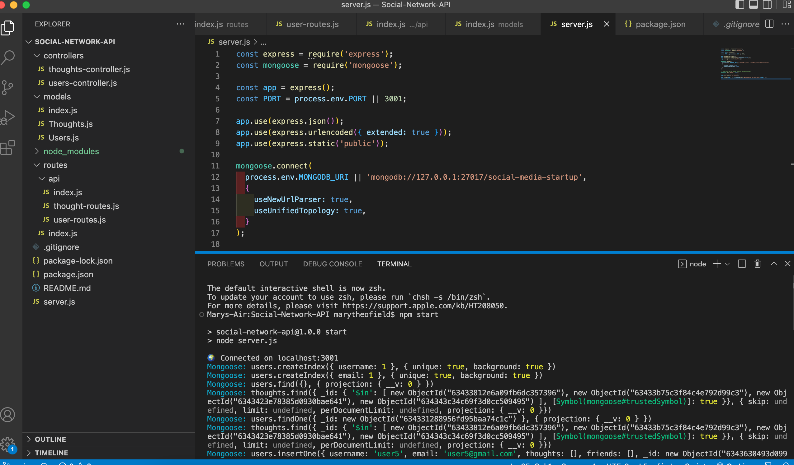

# Social-Network-API

  [](https://opensource.org/licenses/MIT)

  ## Description
The Social Network API was created for a social media startup that wanted an API for their social network that uses NoSQL database so that their website can handle large amounts of unstructured data. 

  ## Table of Contents

  * [Description](#description)
  * [Installation](#installation)
  * [License](#license)
  * [Demo-Video](#demo-video)
  * [Questions](#questions)
  
  ## Installation

  To install this application you wiill need to run the following command:
  ```
   npm i
   npm i mongoose
   npm i moment
  ```
  
  ## License
  This project is covered under the MIT license.

  ## Demo-Video
  A demo for this can be found here (https://drive.google.com/file/d/1kazD96hHOtiIwBRaWI4v6bWLWUJc2V4F/view)

    Example of the integrated terminal
   

    Example of the Insomnia for Users
   

   Example of the Insomnia for Thoughts
   

   Example of the Insomnia for Reactions
   

  ## Questions
  Please reach out to me at the below with any questions:
  
  * Email - mptheofield@gmail.com
  
  or visit my GitHub profile:
  
  * GitHub - [mtheofield](https://github.com/Mtheofield)